# Nexora - Azure 3-Tier E-Commerce Deployment

A practical e-commerce application deployed on Microsoft Azure using separate frontend, backend, and database virtual machines.

**Tech:** Azure VMs, Azure VNet, subnets, NSGs, Ubuntu Linux, Nginx, Node.js, Express.js, PostgreSQL, PM2, HTML, CSS, and JavaScript.

> The repository recreates the source and configuration used by the completed Project 26 deployment. The original deployment evidence is preserved in `screenshots/`, while secrets are intentionally excluded.

## Project highlights

- Designed a 3-tier cloud architecture with separate frontend, backend, and database subnets.
- Used private-IP communication between the tiers.
- Configured Nginx to serve the frontend and reverse proxy `/api/*` requests.
- Deployed a Node.js Express API and managed it with PM2.
- Configured PostgreSQL access for the backend subnet.
- Validated backend health, database connectivity, and product API responses.

## Architecture

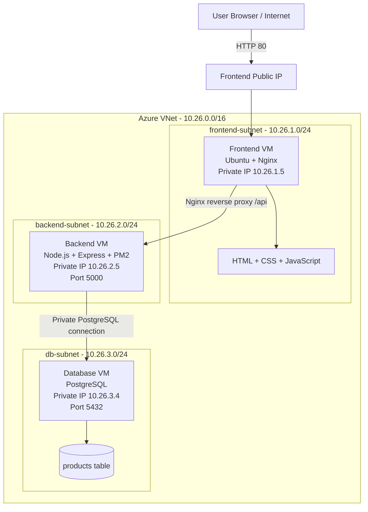

## Traffic flow

```text
Browser
  -> Frontend public IP
  -> Nginx serves the UI
  -> Nginx forwards /api requests to 10.26.2.5:5000
  -> Express queries PostgreSQL at 10.26.3.4:5432
  -> PostgreSQL returns product rows
  -> Express returns JSON
  -> Frontend renders product cards
```

## Repository structure

```text
Nexora-Azure-3Tier-Project/
├── README.md
├── LICENSE
├── SECURITY.md
├── .gitignore
├── frontend/
│   ├── index.html
│   ├── styles.css
│   ├── script.js
│   └── README.md
├── backend/
│   ├── server.js
│   ├── package.json
│   ├── package-lock.json
│   ├── ecosystem.config.js
│   └── .env.example
├── database/
│   ├── schema.sql
│   ├── sample-data.sql
│   └── permissions.sql
├── nginx/
│   └── nexora.conf
├── scripts/
│   └── verify-deployment.sh
├── screenshots/
└── docs/
    ├── DEPLOYMENT.md
    └── Nexora-Project-Documentation.pdf
```

## Azure resources

| Resource | Value |
|---|---|
| Resource group | `rg-nexora-p26` |
| Virtual network | `vnet-nexora-p26` |
| VNet address space | `10.26.0.0/16` |
| Frontend subnet | `10.26.1.0/24` |
| Backend subnet | `10.26.2.0/24` |
| Database subnet | `10.26.3.0/24` |
| Frontend VM | `vm-nexora-frontend` |
| Backend VM | `vm-nexora-backend` |
| Database VM | `vm-nexora-db` |

The IP addresses shown here reproduce the completed lab environment. Treat them as deployment-specific values and update them when recreating the project.

## API endpoints

| Endpoint | Purpose | Example result |
|---|---|---|
| `GET /api/health` | Confirm backend availability | `{"status":"ok","service":"nexora-backend","backend":"vm-nexora-backend"}` |
| `GET /api/db-test` | Verify PostgreSQL connectivity | `{"database":"connected","db_server":"vm-nexora-db","time":"..."}` |
| `GET /api/products` | Return products from PostgreSQL | JSON array of product records |

## Backend environment

Create `backend/.env` from `.env.example` on the backend VM:

```env
DB_HOST=10.26.3.4
DB_PORT=5432
DB_USER=nexora_user
DB_PASSWORD=replace_with_a_strong_password
DB_NAME=nexora_db
DB_SERVER_NAME=vm-nexora-db
PORT=5000
```

The real `.env` file is excluded by `.gitignore`.

## Quick deployment outline

### Database tier

```bash
sudo apt update
sudo apt install postgresql postgresql-contrib -y
sudo systemctl enable --now postgresql
```

Create `nexora_db` and `nexora_user`, load the SQL files from `database/`, configure `listen_addresses`, and allow only `10.26.2.0/24` in `pg_hba.conf`.

### Backend tier

```bash
sudo apt update
sudo apt install nodejs npm -y
cd backend
cp .env.example .env
npm install
npm run check
sudo npm install -g pm2
pm2 start ecosystem.config.js
pm2 save
```

### Frontend tier

```bash
sudo apt update
sudo apt install nginx -y
sudo cp frontend/index.html frontend/styles.css frontend/script.js /var/www/html/
sudo cp nginx/nexora.conf /etc/nginx/sites-available/nexora
sudo ln -sf /etc/nginx/sites-available/nexora /etc/nginx/sites-enabled/default
sudo nginx -t
sudo systemctl restart nginx
```

Complete commands and explanations are in [`docs/DEPLOYMENT.md`](docs/DEPLOYMENT.md).

## Screenshots

### Application

| Homepage and products | Product listing |
|---|---|
| 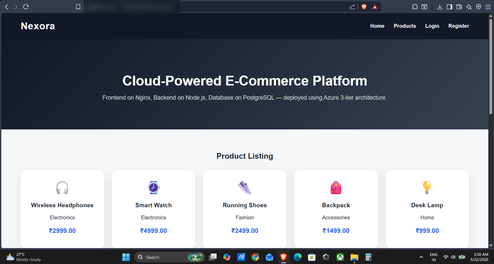 | 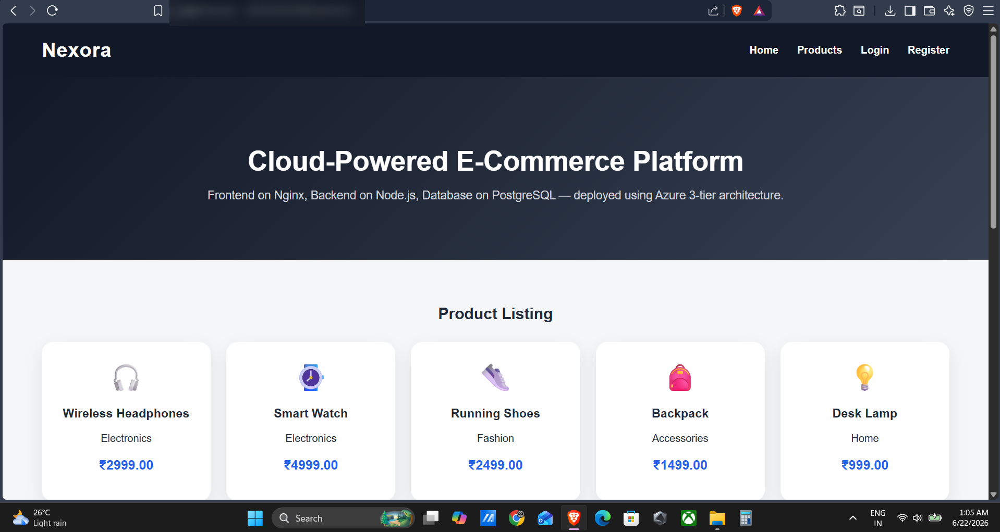 |

### API verification

| Backend health | Database connection | Products API |
|---|---|---|
| 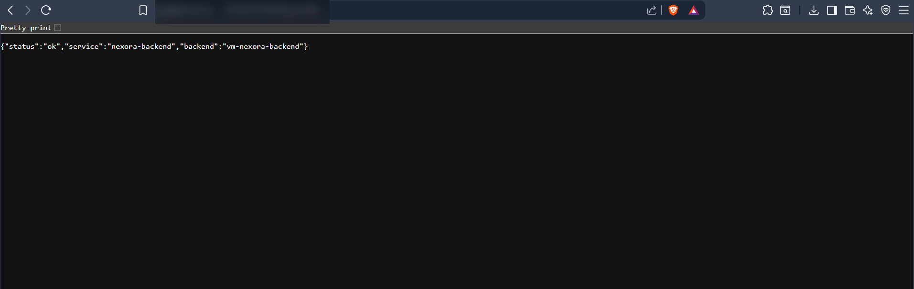 | 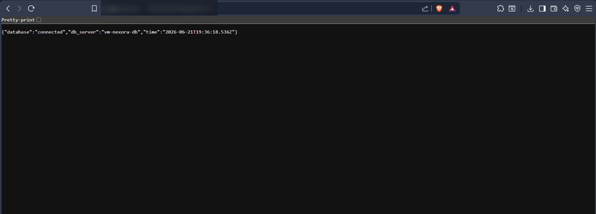 | 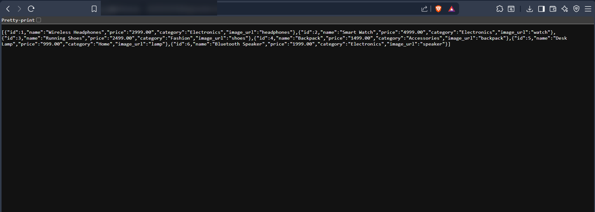 |

### Azure infrastructure

| Resource group | VM list |
|---|---|
| 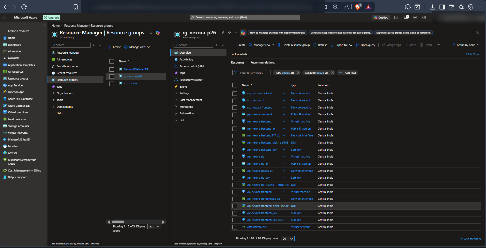 | 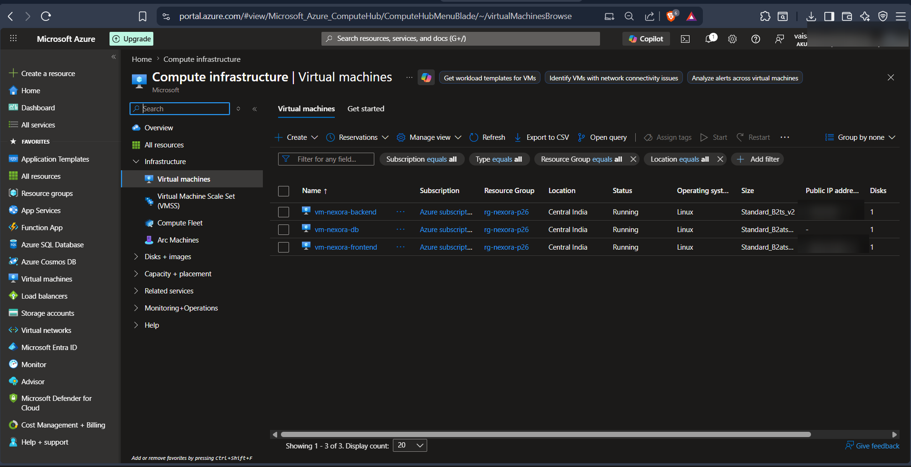 |

| Frontend VM | Backend VM | Database VM |
|---|---|---|
| 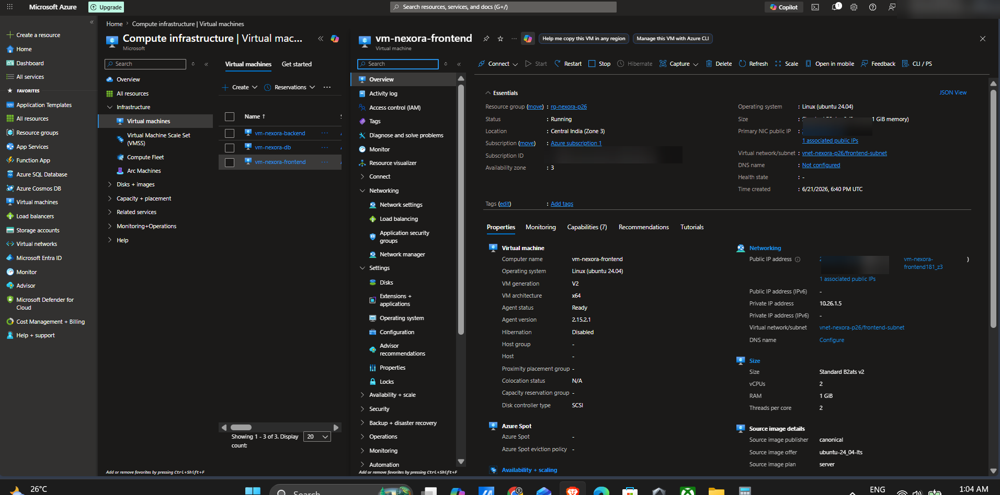 | 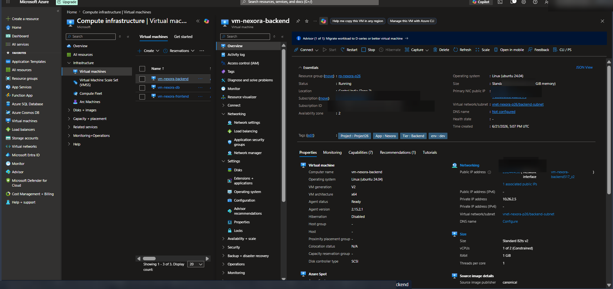 | 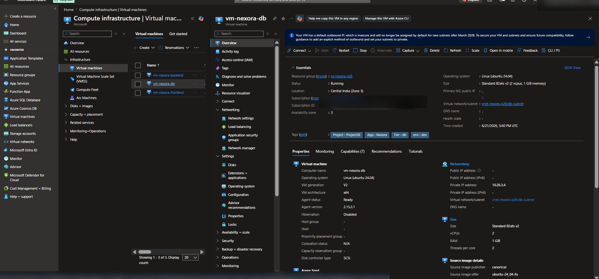 |

## Problems faced and fixes

| Problem | Cause | Fix |
|---|---|---|
| Frontend had no public IP | Public IP was not attached during VM creation | Created and associated a Standard static public IP |
| Backend package installation failed | Private VM had no outbound package access | Temporarily attached public access for installation, then planned removal |
| Product API returned permission denied | PostgreSQL table and sequence permissions were missing | Granted table and sequence permissions to `nexora_user` |

## Security design

- Only the frontend VM should be publicly exposed in the final state.
- Backend and database communication uses private IPs inside the VNet.
- Nginx hides the backend private IP from browser clients.
- The real `.env` file, SSH keys, and credentials are excluded from Git.
- Azure Key Vault and managed identity are recommended production improvements.
- HTTPS, monitoring, backup, and a managed PostgreSQL service would be appropriate next steps.

## Verification

```bash
chmod +x scripts/verify-deployment.sh
./scripts/verify-deployment.sh http://<FRONTEND_PUBLIC_IP>
```

PM2 checks on the backend VM:

```bash
pm2 status
pm2 logs nexora-backend
```

## Resume description

**Nexora - Azure 3-Tier E-Commerce Deployment**

- Designed and deployed a 3-tier cloud architecture with separate frontend, backend, and database subnets using private-IP communication between tiers.
- Configured PostgreSQL access, Node.js API endpoints, PM2 process management, and Nginx frontend serving; validated health checks, database connectivity, and product APIs.

## What I learned

- Designing Azure VNets, subnets, NSGs, and public/private IP access.
- Deploying and operating Linux-based application servers.
- Configuring Nginx as a web server and reverse proxy.
- Managing a Node.js service with PM2.
- Securing PostgreSQL connectivity between private tiers.
- Validating a deployment end-to-end with API health checks.

## Documentation

A GitHub-safe version of the project deployment document is included in `docs/`.

## License

This project is available under the [MIT License](LICENSE).
